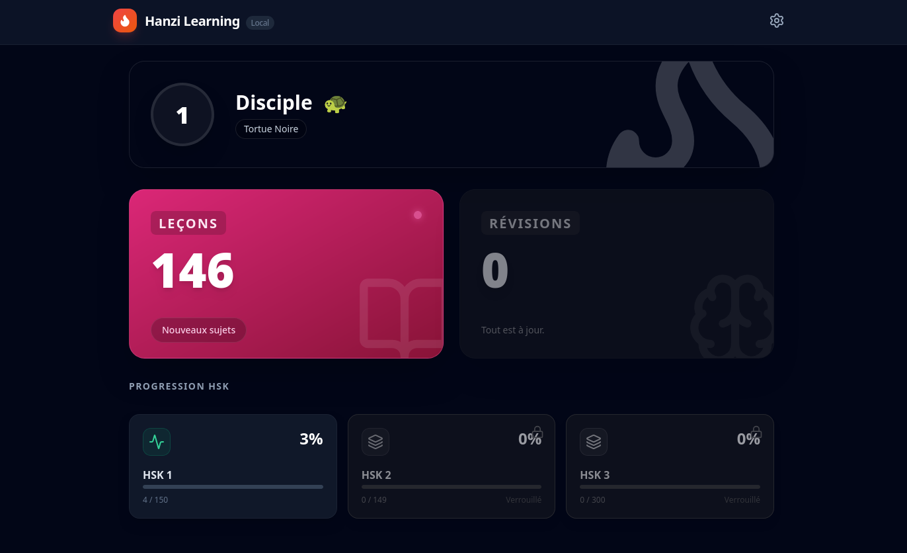
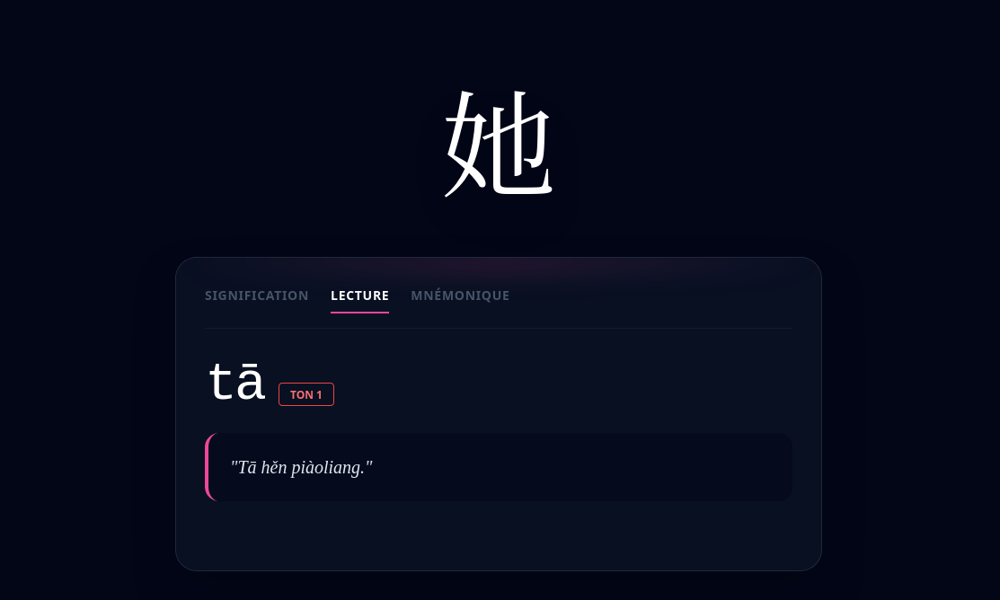
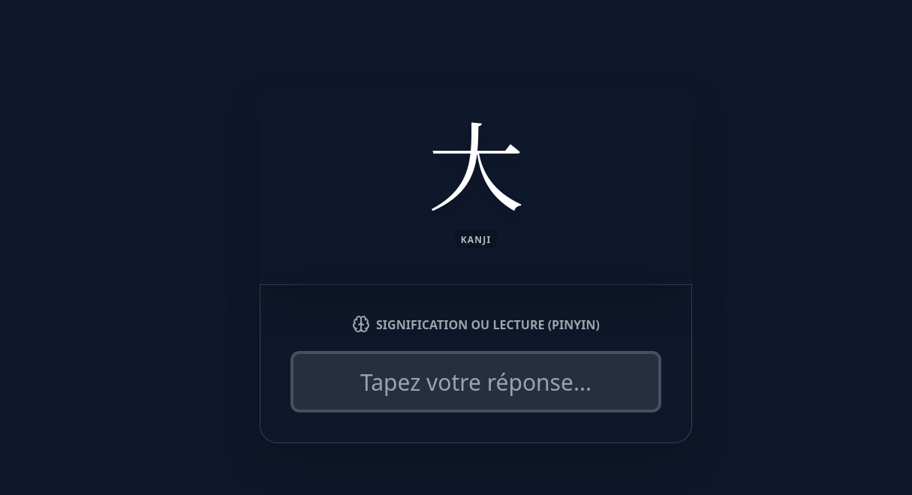
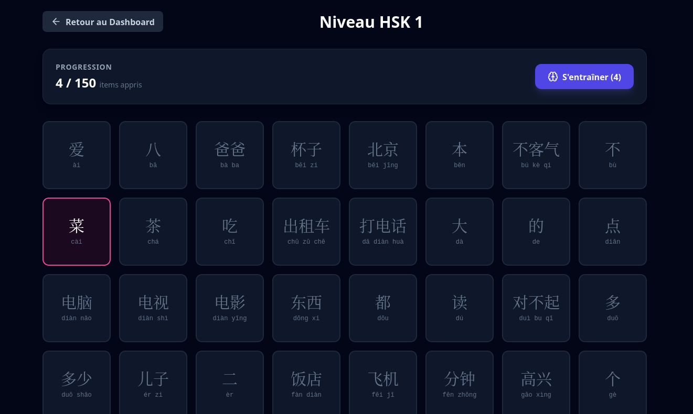

# Hanzi-Learning
learning app with memo cards to learn chinese characters from french


<table align="center">
  <tr>
    <td align="center" valign="top">
      
    </td>
    <td align="center" valign="top">
      
    </td>
  </tr>
  <tr>
    <td align="center" valign="top">
      
    </td>
    <td align="center" valign="top">
      
    </td>
  </tr>
</table>

---

## How to use

### First time
just run
```
./setup.sh
```
this will setup the database and add the hsk characters before launching the app

Note: there is only up to hsk3 in `data/`

### Then
run
```
npm run dev
```
## Disclaimer

- this is meant to be used in local, probably not secure lol
- this has been done (vibecoded) in one afternoon so there might(are) be bugs


